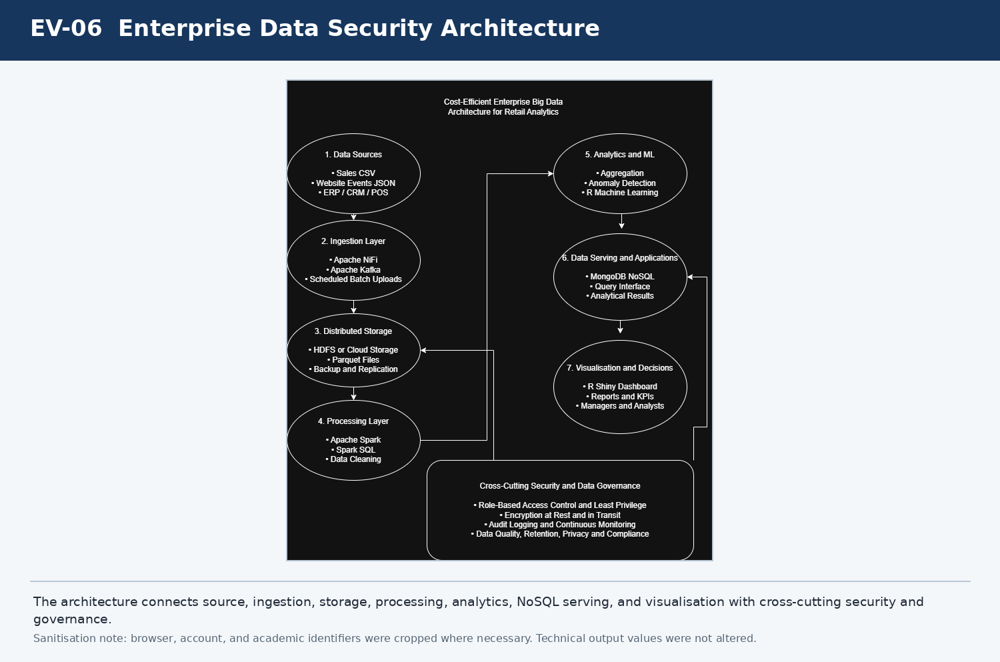

# Enterprise Data Security Governance and Technical Controls Implementation

[](#portfolio-classification)
[](#grc-outcomes)
[](#ai-assisted-delivery)

A working enterprise analytics prototype translated into a complete data security governance, risk, privacy, model governance, and control assurance case study for Northstar Retail Group.

> **Portfolio classification:** This is a simulated portfolio implementation. It is not a client engagement, production deployment, regulatory certification, or legal opinion.

[View the recruiter friendly Notion case study](https://cautious-satin-6b0.notion.site/Enterprise-Data-Security-Governance-and-Technical-Controls-Implementation-Portfolio-Case-Study-3a693b2a32e7814b89c8d8b6e3b652fe)

## Why this project matters

Enterprise analytics introduces more than processing and reporting concerns. Data must remain accurate, appropriately accessed, protected from disclosure, retained only as needed, and used responsibly.

This project demonstrates two connected capabilities:

1. Technical implementation across Spark, Parquet, R, Shiny, MongoDB, and a basic query application.
2. Translation of implementation results into risks, controls, ownership, evidence, privacy decisions, retention rules, model oversight, and management recommendations.

## Simulated business scenario

Northstar Retail Group is a simulated mid sized omnichannel retailer. The organisation processes retail transactions, website events, analytical summaries, model outputs, NoSQL documents, and dashboard results.

Management needs assurance that:

* source data is trustworthy and correctly parsed;
* access follows business roles and least privilege;
* credentials and database connections remain protected;
* dashboards reveal only appropriate information;
* model outputs are not misused;
* data is retained and deleted according to approved rules;
* cloud services are monitored and recoverable; and
* each control claim is supported by evidence.

## Implementation summary

The prototype performs:

1. Structured CSV and semi structured JSON ingestion.
2. Schema inspection, type correction, parsing control, and null validation.
3. Parquet storage and record count reconciliation.
4. Spark profiling, filtering, grouping, aggregation, and anomaly detection.
5. Local cached and uncached processing comparison.
6. R based regression training and test evaluation.
7. R Shiny dashboard filtering and model result visualisation.
8. MongoDB document insertion, projection, sorting, and filtering.
9. Basic Gradio application queries against MongoDB.
10. Governance, risk, privacy, retention, model governance, and control mapping.

## Validated results

| Result area | Validated result |
|---|---:|
| Retail transaction records | 9,994 |
| Simulated website event records | 100 |
| Loss making transaction rows | 1,871 |
| Loss making percentage | 18.72% |
| High discount rows at 50% or above | 922 |
| Strongest category sales | Technology, 836,154.03 |
| Strongest region sales | West, 725,457.82 |
| Training rows | 7,995 |
| Testing rows | 1,999 |
| Test MAE | 57.49 |
| Test RMSE | 223.13 |
| Test R squared | 0.4270 |
| MongoDB analytical documents | 12 |

## GRC outcomes

The project includes:

* 11 asset data inventory and classification register;
* 12 risk data security register with inherent and residual scoring;
* 12 action risk treatment plan;
* 20 control catalogue;
* control to evidence matrix;
* role based access matrix;
* governance RACI;
* retention and secure disposal schedule;
* privacy assessment;
* model risk governance record;
* technical evidence register;
* management recommendations;
* residual risk conclusion; and
* transparent AI use and human validation disclosure.

## Current decision

**The prototype is suitable for portfolio demonstration and controlled improvement planning. It is not approved for production deployment.**

Production approval remains dependent on:

* restricted database connectivity;
* enforced role based access and periodic review;
* authenticated and role aware applications;
* central logging and alerting;
* tested backup and recovery;
* approved retention automation;
* formal third party risk review;
* incident response exercises; and
* independent model validation and monitoring.

## Architecture



The architecture connects source systems, ingestion, storage, Spark processing, analytics and modelling, MongoDB serving, applications, and management dashboards. Security and governance apply across every layer.

## Repository structure

```text
enterprise-data-security-governance/
├── README.md
├── SECURITY.md
├── LICENSE
├── CITATION.cff
├── AI_ASSISTED_WORKFLOW.md
├── requirements.txt
├── architecture/
├── docs/
├── governance_artifacts/
├── technical_evidence/
├── src/
├── sample_outputs/
├── dataset/
├── artifacts/
└── launch_materials/
```

## Quick review path

1. Read the professional case study in `docs/professional_case_study.pdf`.
2. Review the editable governance workbook in `governance_artifacts/`.
3. Open `docs/GRC_ARTEFACT_GUIDE.md`.
4. Review the sanitised evidence cards in `technical_evidence/`.
5. Inspect the reference scripts in `src/`.
6. Read the residual risk and model governance statements.

## AI assisted delivery

AI tools supported planning, drafting, code assistance, spreadsheet generation, control mapping, and quality review.

Human responsibility remained with the portfolio owner for:

* environment and account access;
* dataset handling;
* technical execution;
* screenshot capture;
* output validation;
* risk and control decisions;
* review of public evidence; and
* final approval.

See `AI_ASSISTED_WORKFLOW.md`.

## Privacy and responsible use

Do not use this repository as a production security design or as the sole basis for real pricing, customer, employee, or operational decisions.

Do not commit:

* live customer or behavioural data;
* credentials or connection strings;
* temporary application links;
* personal account identifiers;
* unsanitised screenshots;
* protected internal logs; or
* generated secrets.

## Limitations

* The organisation and website events are simulated.
* The environment is a prototype rather than a production deployment.
* The Spark timing test used a small local runtime.
* The regression model has limited explanatory power and no independent validation.
* Authentication and central monitoring were not implemented as production controls.
* Retention periods are illustrative and require legal and business approval.
* Formal vendor assurance and recovery testing remain incomplete.

## Author

**John Chidi Goodluck**  
GRC professional focused on AI governance, privacy, cybersecurity, data security, and technology risk.

## Licence

Code and documentation in this repository are released under the MIT Licence. Third party datasets are not included and remain subject to their own terms.
